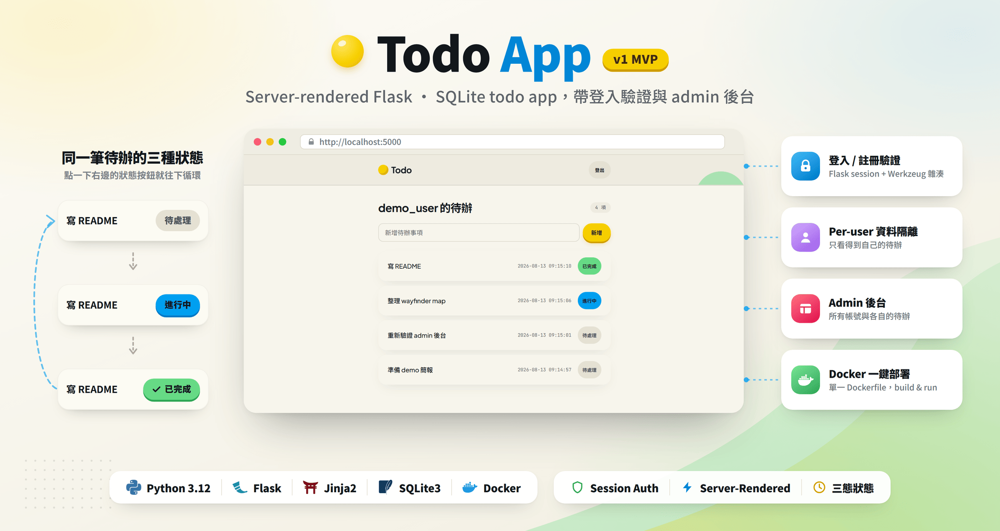
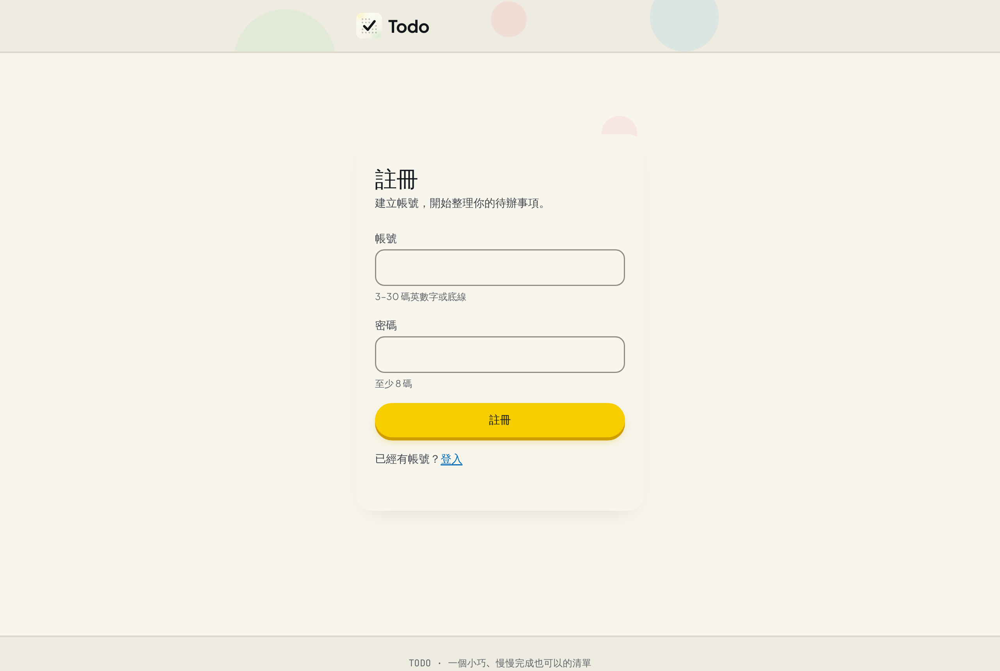
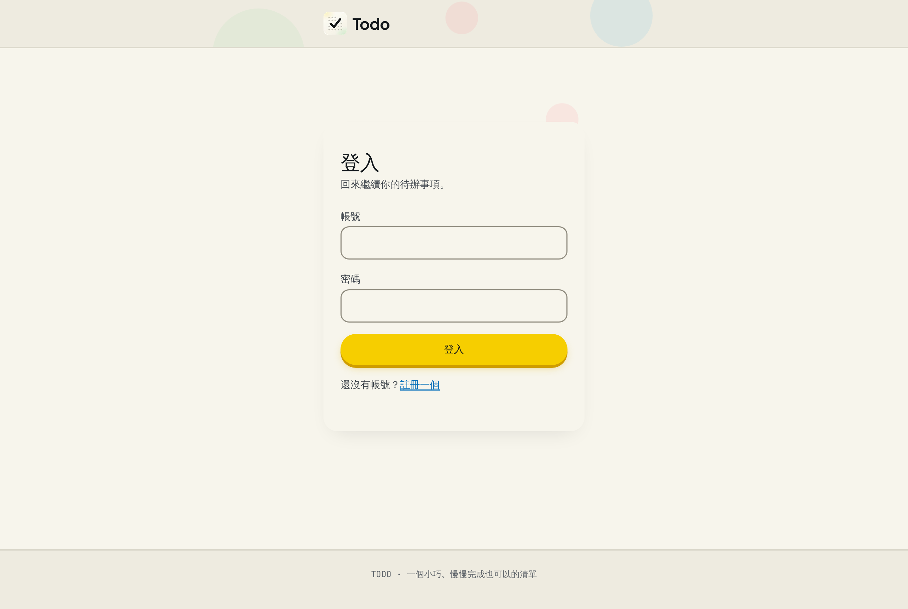
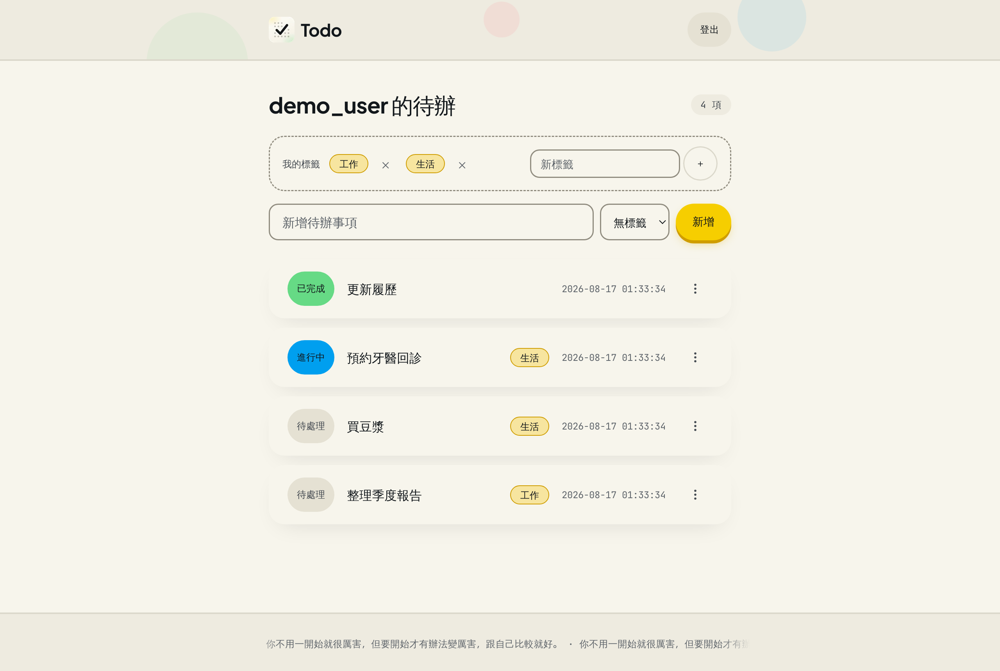
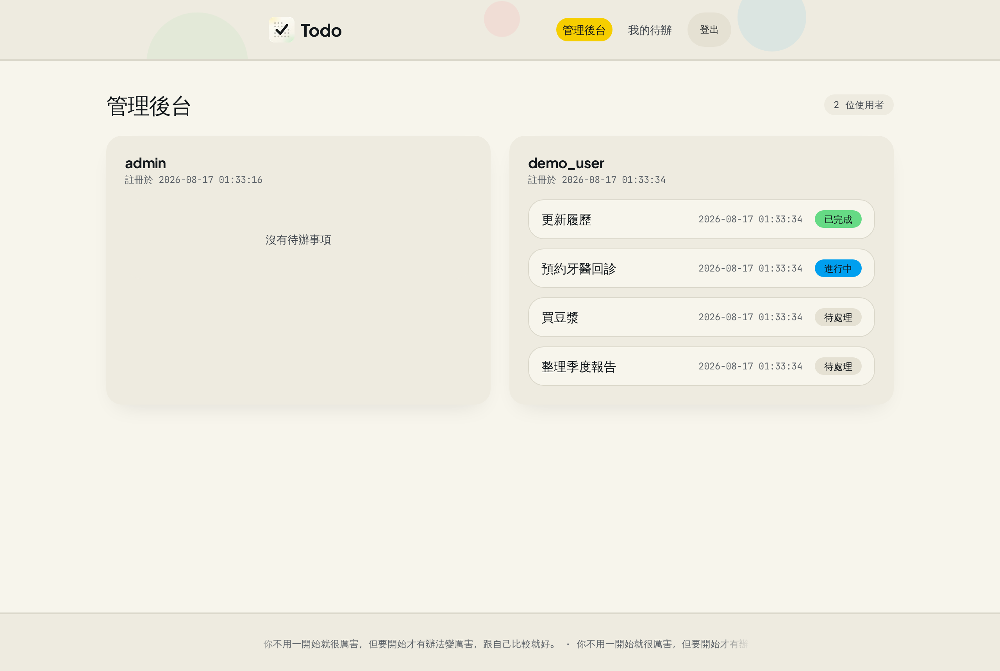
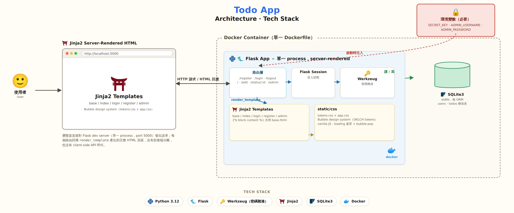

<br />
<div align="center">
  <h1 align="center">
    <a href="https://github.com/allisdonglincai/todo-mvp"></a> Todo App <sup>v1 MVP</sup>
  </h1>
</div>

<p align="center">
  <a href=".scratch/todo-mvp-wrapup/v1-contract.md">路由 / schema 契約</a>
  &middot;
  <a href="#usage">Usage</a>
  &middot;
  <a href="#architecture--how-this-was-built">Architecture</a>
  &middot;
  <a href=".scratch/todo-mvp-wrapup/map.md">Wayfinder Map</a>
</p>

<!-- PROJECT SHIELDS -->
<p align="center">
  <a href="https://www.python.org/"></a>
  <a href="https://flask.palletsprojects.com/"></a>
  <a href="https://www.sqlite.org/"></a>
  <a href="https://www.docker.com/"></a>
  <a href="LICENSE"></a>
</p>

---



<!-- TABLE OF CONTENTS -->
<details>
  <summary>Table of Contents</summary>
  <ol>
    <li><a href="#about-the-project">About The Project</a></li>
    <li><a href="#features">Features</a></li>
    <li>
      <a href="#getting-started">Getting Started</a>
      <ul>
        <li><a href="#prerequisites">Prerequisites</a></li>
        <li><a href="#installation">Installation</a></li>
      </ul>
    </li>
    <li><a href="#usage">Usage</a></li>
    <li><a href="#architecture--how-this-was-built">Architecture &amp; How This Was Built</a></li>
    <li><a href="#roadmap">Roadmap</a></li>
    <li><a href="#license">License</a></li>
    <li><a href="#acknowledgments">Acknowledgments</a></li>
  </ol>
</details>

<!-- ABOUT THE PROJECT -->
## About The Project

一個刻意保持小巧的 Todo app：註冊、登入、per-user 的待辦清單、三態狀態（未處理／進行中／已完成），以及一個 admin 後台可以看到所有帳號跟各自的待辦事項。伺服器端渲染的 Flask + SQLite，單一 Dockerfile 部署，沒有前端框架、沒有 ORM——技術棧與請求流向的完整架構圖，見 [Architecture &amp; How This Was Built](#architecture--how-this-was-built)。

這個 repo 真正的目的不是 Todo app 本身，而是拿它當載體，練習「在時間盒內用結構化方式與 agent 協作交付」——用 [wayfinder](.scratch/todo-mvp-wrapup/map.md) 拆解決策、用 4 個獨立的 Claude Code session（1 個 coordinator + backend / frontend / devops 三個 worker）平行開發，細節同樣在 [Architecture](#architecture--how-this-was-built)。

刻意不做的事：刪除 todo、正式 WSGI server（目前仍是 Flask dev server）——這些是明確排出範圍的決定，不是漏做。

<!-- FEATURES -->
## Features

<table>
<tr>
<td width="50%" valign="middle">

### 開放註冊

任何人都能自建帳號——帳號 3–30 碼英數字或底線、密碼至少 8 碼，畫面上直接標出規則；送出後後端會再驗一次，不是只靠前端擋。

[路由契約 →](.scratch/todo-mvp-wrapup/v1-contract.md#輸入驗證規則前端-html5-屬性--後端二次驗證都要)

</td>
<td width="50%">
  
</td>
</tr>
<tr>
<td width="50%" valign="middle">

### 登入保護

沒登入進不了 `/`——每個頁面過場都會先擋一次，登入態走 Flask 內建 session，不是裝飾用的假保護。

[Usage →](#usage)

</td>
<td width="50%">
  
</td>
</tr>
<tr>
<td width="50%" valign="middle">

### Per-user 三態待辦

新增、查詢都只看得到自己的資料；狀態不是打勾了事，是「未處理 → 進行中 → 已完成」點一下循環一格，三色一眼分辨。

</td>
<td width="50%">
  
</td>
</tr>
<tr>
<td width="50%" valign="middle">

### Admin 後台

admin 帳號在部署時用環境變數指定，不能自己升級自己；登入後可以看到所有帳號跟各自的待辦，一眼掌握全站狀態。

</td>
<td width="50%">
  
</td>
</tr>
</table>

<!-- GETTING STARTED -->
## Getting Started

### Prerequisites

* Docker
  ```sh
  docker --version
  ```

### Installation

1. Clone 這個 repo
   ```sh
   git clone <this-repo> && cd allis0813-claude-code-basic
   ```
2. Build image
   ```sh
   docker build -t todo-mvp .
   ```
3. 帶著三個必要的環境變數啟動（缺任何一個 app 會啟動失敗，不會用假值蓋掉忘記設定的問題）
   ```sh
   docker run -d --name todo-mvp \
     -p 5000:5000 \
     -e SECRET_KEY=change-me \
     -e ADMIN_USERNAME=admin \
     -e ADMIN_PASSWORD=change-me-too \
     todo-mvp
   ```
4. 打開 [http://localhost:5000/](http://localhost:5000/)，未登入會直接被導到 `/login`

<!-- USAGE EXAMPLES -->
## Usage

一般使用者：`/register` 開放自由註冊 → `/login` → 首頁只看得到自己的 todo → 點狀態按鈕在「未處理 → 進行中 → 已完成」之間循環 → `/logout`。

Admin：用啟動時指定的 `ADMIN_USERNAME` / `ADMIN_PASSWORD` 登入，進 `/admin` 可以看到所有已註冊帳號與各自的 todo（含建立時間、狀態）；非 admin 存取這個路由會被拒絕。

| Method | Path | 需要登入 | 需要 admin |
|---|---|---|---|
| GET/POST | `/register` | 否 | 否 |
| GET/POST | `/login` | 否 | 否 |
| POST | `/logout` | 是 | 否 |
| GET | `/` | 是 | 否 |
| POST | `/add` | 是 | 否 |
| POST | `/status/<int:todo_id>` | 是 | 否 |
| GET | `/admin` | 是 | 是 |

完整的路由/schema/驗證規則契約在 [`v1-contract.md`](.scratch/todo-mvp-wrapup/v1-contract.md)；本地跑測試：

```sh
pytest test_app.py
```

端對端驗證（build → 註冊 → 登入 → 新增 → 三態循環 → admin 檢視 → 重啟後資料仍在）：

```sh
bash scripts/verify_deploy.sh
```

<!-- ARCHITECTURE -->
## Architecture & How This Was Built

**執行期**：Flask 單一 process，server-rendered（沒有前後端分離），登入態走 Flask 內建 session，密碼雜湊走 Werkzeug，資料存在同一個 container 裡的 SQLite 檔案。

<p align="center">
  
</p>

**開發期（Multi-Agent Workflow）**：v1 的登入/驗證/admin/三態範圍是用 4 個獨立的 Claude Code session 平行開發出來的：

| Session | 負責檔案 | 收斂方式 |
|---|---|---|
| `main` / coordinator | 不改程式碼，只 dispatch、驗證、合併 | 對每個 lane 獨立重跑一次檢查，不採信自我回報 |
| `backend` | `app.py`, `test_app.py` | `/goal` + `pytest` |
| `frontend` | `templates/`, `static/` | `/goal` + 靜態檢查與瀏覽器操作 |
| `devops` | `Dockerfile`, `requirements.txt`, `scripts/` | `/goal` + `scripts/verify_deploy.sh` |

三個 worker 各自在獨立的 git worktree（`backend-lane` / `frontend-lane` / `devops-lane` 分支）裡工作，檔案互不重疊，透過 `orca-ide` 收發訊息；main 驗證通過才 `merge --no-ff` 回 `master`。決策記錄、路由契約、驗證腳本都在 [`.scratch/todo-mvp-wrapup/`](.scratch/todo-mvp-wrapup/)：

* [`map.md`](.scratch/todo-mvp-wrapup/map.md) — wayfinder map，所有拍板過的決策
* [`v1-contract.md`](.scratch/todo-mvp-wrapup/v1-contract.md) — 三個 lane 共用的路由/schema/驗證規則
* [`coordinator-protocol.md`](.scratch/todo-mvp-wrapup/coordinator-protocol.md) / [`operating-principles.md`](.scratch/todo-mvp-wrapup/operating-principles.md) — main 的 dispatch 流程與四個 session 共同遵守的停止條件

UI 樣式走的是 `hallmark` 產出的一套鎖定 design system（[`design.md`](design.md)：Bubble 主題，pear / sky-cyan / coral 三個 accent），四個頁面共用同一組 token，不是每頁各自亂設計。

<!-- ROADMAP -->
## Roadmap

- [x] Todo CRUD 雛型（新增／查詢／狀態）+ SQLite 持久化
- [x] 登入 / 註冊 / 登出 + per-user 資料隔離
- [x] Admin 後台（帳號清單 + 各帳號 todo）
- [x] 三態狀態、loading 過渡、雙層輸入驗證
- [x] Docker 端對端驗證腳本
- [ ] 期限（due date）、標籤 — 曾經在候選清單上，目前沒有排入範圍
- [ ] 刪除 todo — 明確排除，不在計畫內
- [ ] 正式 WSGI server（目前仍是 Flask dev server）— 明確決議維持現狀，見 [Ticket 01](.scratch/todo-mvp-wrapup/issues/01-mvp-hardening-scope.md)

<!-- LICENSE -->
## License

Distributed under the MIT License. See [`LICENSE`](LICENSE) for more information.

<!-- ACKNOWLEDGMENTS -->
## Acknowledgments

* [Getting started with loops](https://www.anthropic.com) / [Loop Engineering](https://addyosmani.com/blog/loop-engineering/) — 這次 4-session AFK dispatch 設計的思維來源
* [Best-README-Template](https://github.com/othneildrew/Best-README-Template) — 這份 README 的架構範本
* [Flask](https://flask.palletsprojects.com/) / [Werkzeug](https://werkzeug.palletsprojects.com/) 文件
* `orca-ide` — 驅動這次 4 個 session 平行協作的 terminal/worktree/orchestration 工具
